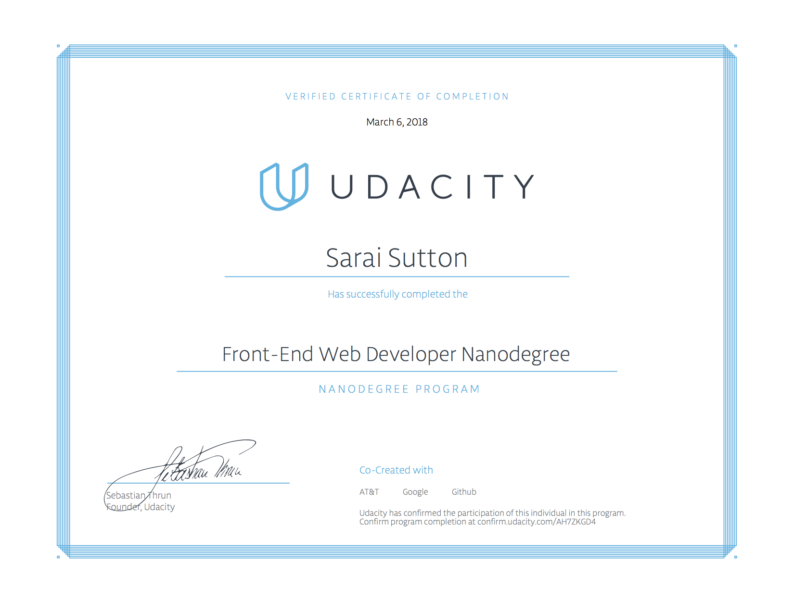

# Udacity | Front End Web Developer Nanodegree

> The Front End Developer Nanodegree program is comprised of 8 projects. With each project, you'll create something that demonstrates your mastery of in-demand skills. Projects range in complexity, and each builds upon the previous. In the end, you will have a resume-worthy portfolio that you can showcase to prospective employers.

Udacity has been a interesting/knowledge filled journey for me. My resilience and determination helped me get through the tough times of failed projects. I really learned how to use all available resources, study, and apply myself fully. I am grateful that I was awarded this opportunity; it not only gave me much needed experience but it also gave me the fuel to not stop here, keep going and keep learning!

 

The projects in this course:
* Animal Trading Cards | https://ssutton427.github.io/udacity-fend/animal-trading-cards/card.html
* Portfolio | https://ssutton427.github.io/udacity-fend/portfolio/index.html
* Resume | https://ssutton427.github.io/udacity-fend/resume/index.html
* Arcade Game | https://ssutton427.github.io/udacity-fend/frogger/index.html
* Web Optimization | https://ssutton427.github.io/udacity-fend/web_ops/index.html
* Neighborhood Map | https://ssutton427.github.io/udacity-fend/neighborhood-map/index.html
* Feed Reader Testing | https://ssutton427.github.io/udacity-fend/feed-reader-testing/index.html
